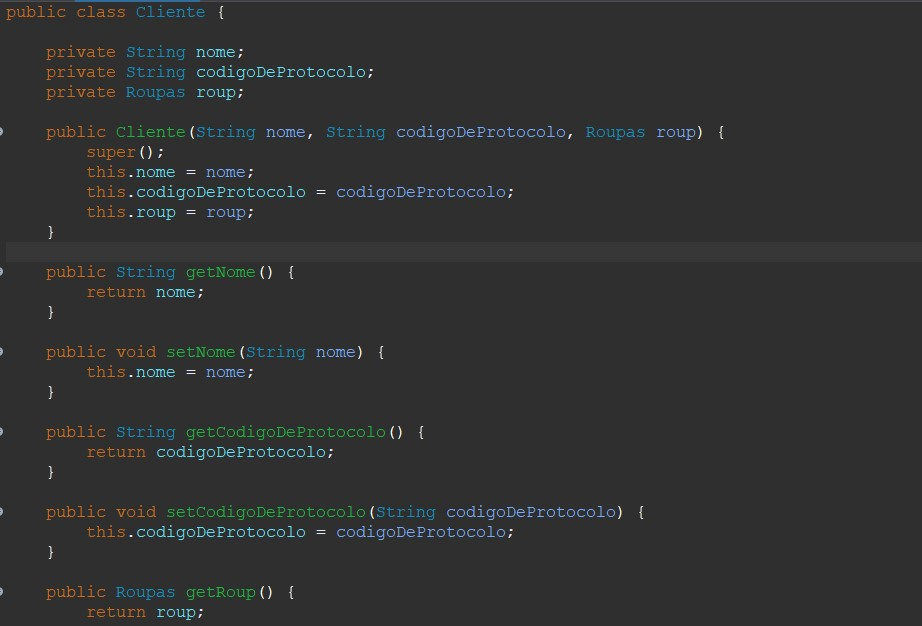

<h2> Engenheiro </h2>

"We see three critical differences between programming and software engineering: time, scale, and the trade-offs at play. On a software engineering project, engineers
need to be more concerned with the passage of time and the eventual need for change. In a software engineering organization, we need to be more concerned about scale and
efficiency, both for the software we produce as well as for the organization that is producing it. Finally, as software engineers, we are asked to make more complex
decisions with higher-stakes outcomes, often based on imprecise estimates of time and growth. Within Google, we sometimes say, “Software engineering is programming 
integrated over time.” Programming is certainly a significant part of software engineering: after all, programming is how you generate new software in the first place. 
If you accept this distinction, it also becomes clear that we might need to delineate between programming tasks (development) and software engineering tasks (development,
modification, maintenance). The addition of time adds an important new dimension to programming. Cubes aren’t squares, distance isn’t velocity. Software engineering isn’t
programming."

Titus Winters, Software Engineering at Google

<h4>Comentário:</h4> Com base no texto foi possivel compreender o que muitas vezes seria descrito como apenas nuâncias de mesmos conceitos. A programação está na engenharia de software, porém como um dos pilares que a compõem. Tendo todos esses fatores em mente, a engenharia de software é em comparação mais complexa e completa, levando em conta fatores de grande importância no desenvolvimento como o tempo e a acertividade das aplicações desenvolvidas em ambinetes muitas vezes mutáveis.

<h4>O que é trade-off:</h4> Situação em que há conflito de escolha que visa à resolução de problema mas acarreta outro, obrigando uma escolha.

                                                                    Trade-off dentro do API
     A decisão de ideias foi parte fundamental para a criação de estrategias no que hoje compõem o plano de desesnvolvimento do API.

<h2> Ciclo de Vida do Desenvolvimento de Software </h2>

<h4> Situação: </h4> Uma loja de roupas necessita de uma aplicação que faça o cadastro dos seus clientes, busque-os por Código de Protocolo, pelas características de suas roupas e por fim compare determinadas roupas.
 
<h4> Requisitos Funcionais: </h4>

- Cadastramento de Clientes: Parte em que se possa cadastrar o cliente, passando seus dados, como Nome, Código de Protocolo e Roupas;
- Roupas: Passar os dados para armazenar as roupas do cliente, como Tamanho, Cor e a Marca.

<h4> Diagrama de Casos de Uso: </h4>

<h4>Requisitos Não Funcionais:</h4>

- Confiabilidade;
- Transparência;
- Portabilidade; e
- Mobilidade.

<h4>Diagrama de Classes UML:</h4>

<h4>Requisitos Código</h4>

