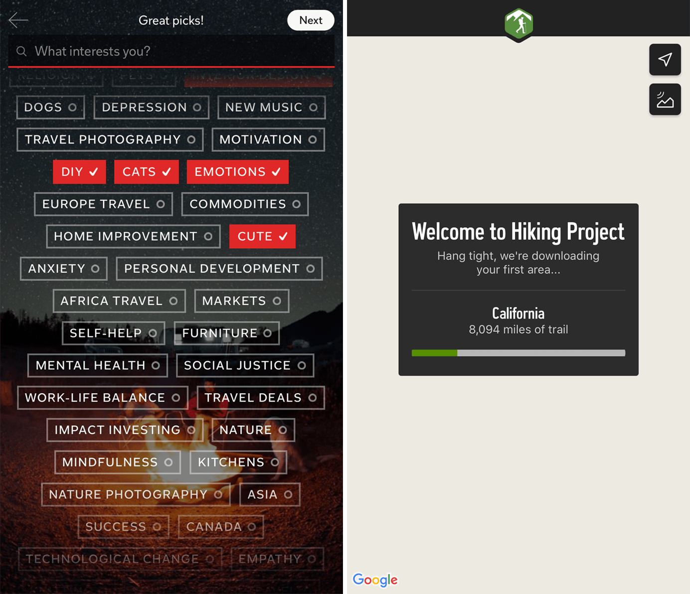
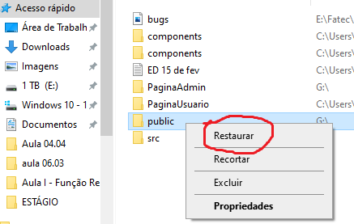
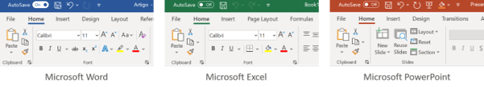
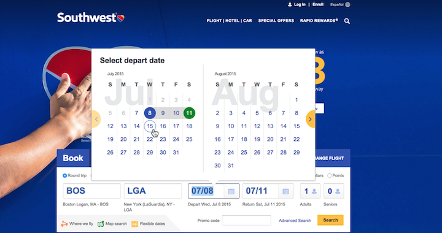
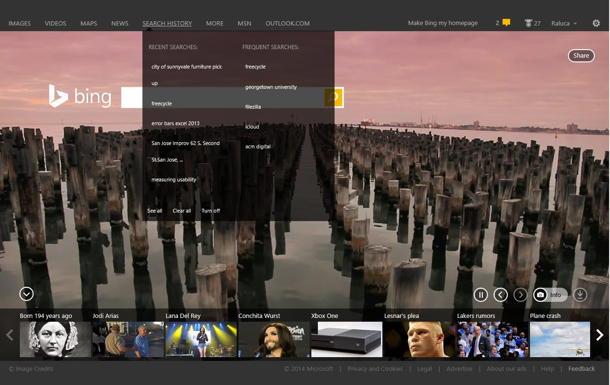
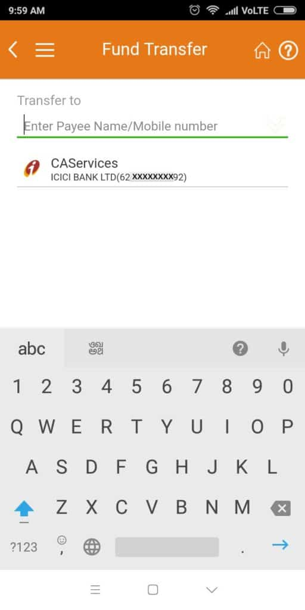
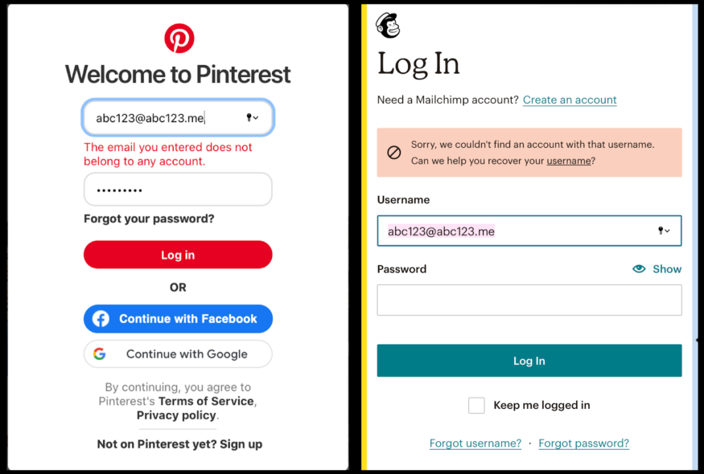
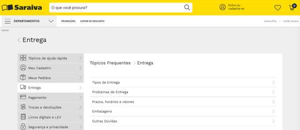

<h2> Avaliação heurística GUI </h2>

<h3>Heurística 1. Visibilidade do status do sistema.</h3>

A primeira heurística é denominada visibilidade do status do sistema e está associada mais à comunicação e transparência, que são essenciais para muitos aspectos da vida. As pessoas se esforçam por previsibilidade e controle e, na maioria dos casos, mais informações se traduzem em melhores decisões.

No exemplo acima alterar a cor e adicionar uma marca de seleção aos botões em uma tela de seleção comunica que o sistema registrou as escolhas do usuário (esquerda). Os indicadores de progresso garantem ao usuário que uma espera mais longa é normal e que o sistema ainda está funcionando (à direita).  
Em contrapartida às interfaces de usuário de manipulação direta, as interfaces de linha de comando não exibem o estado atual do sistema, nem fornecem feedback imediato. Os programadores sabem como pode ser difícil localizar a origem de um erro em uma interface que carece de feedback imediato, eles frequentemente precisam recorrer a ferramentas como pontos de interrupção e revisão para entender como o estado do sistema muda com cada ação especificada em seu código.

<h3>Heurística 2. Correspondência entre o sistema e o mundo real.</h3>

A segunda heurística tem como objetivo os seres humanos encontrarem conforto e familiaridade ao se relacionarem com a interface. Por este motivo que a segunda heurística, afirma que a correspondência entre o sistema e o mundo real é tão importante. O sistema deve falar o idioma dos usuários, com palavras, frases e conceitos familiares ao mesmo, em vez de termos mais complexos. O ideal é seguir as convenções do mundo real, fazendo com que as informações apareçam em uma ordem natural e lógica.

No exemplo acima o site fornece respostas claras às perguntas, usa uma linguagem familiar e inclui referências que são fáceis de entender.  
Diferentemente, no exemplo abaixo, a página sobre o site do software jurídico da Abacus contém uma linguagem extremamente técnica. A linguagem usada na seção Fatos rápidos, da nuvem privada do Abacus, é desnecessariamente complexa e usa termos que apenas um profissional de TI especializado entenderia e não um advogado ou usuário comum. Além disso, a interface inclui várias siglas, mas não explica seu significado. Não faz sentido presumir que os usuários compreenderão uma abreviatura no seu primeiro contato com o site.

<h3>Heurística 3. Sobre controle e liberdade do usuário.</h3>

Dar ao usuário a capacidade de controlar e ter a liberdade de desfazer e refazer suas ações, intencionais e não intencionais, caso deixemos de fornecer ao usuário o controle e a liberdade sobre o que está usando, ele abandonará o uso da interface. É muito importante fornecer a eles a opção de corrigir seus erros ou desfazer e refazer suas ações.

O exemplo acima representa o sistema operacional Windows que dá a opção de restaurar os itens excluídos da lixeira.
Em contrapartida uma interface que não fornece opções para desfazer ações ou finalizar um processo, fazendo com que o usuário fique preso em um estado indesejado, não demonstra nenhuma liberdade ao usuário e ele não se sentirá no controle da mesma.

<h3>Heurística 4. Consistência e padrões.</h3>

Não devemos deixar o usuário em dúvida se palavras, situações ou ações diferentes tem o mesmo significado, para isso a interface deve manter uma consistência, permitindo que o usuário identifique os padrões de estética, interação e informação existentes nesta.

No exemplo acima eu tenho alguns dos menus dos programas Microsoft. Os programas da Microsoft seguem padrões, sendo que os itens do menu ficam sempre na parte superior, os ícones que realizam a mesma ação são repetidos em todas as interfaces, mantém o tamanho e cor.  
Um dos problemas que poderiam vir a ocorrer caso não se siga padrões e não se mantenha a consistência seria se um designer desenvolvesse um site e nele utilizasse diferentes elementos para a mesma função em diferentes partes do site, fazendo o usuário ficar perdido.

<h3>Heurística 5. Prevenção de Erros.</h3>

É importante comunicar os erros aos usuários de maneira harmoniosa, prática e clara. No entanto, é ainda melhor evitar que os usuários cometam erros em primeiro lugar.

O sistema de calendário da Southwest para escolher datas de voos utiliza restrições úteis para evitar que os usuários definam acidentalmente um intervalo de tempo sem sentido. Mesmo que os usuários tentem definir a data de retorno antes da data de partida, este widget os força a escolher uma data de partida primeiro. Além disso, ele sutilmente usa cores para fornecer contexto sobre qual data está prestes a ser alterada (neste caso, azul para a partida), o que ajuda os usuários a enxergar qual campo eles estão selecionando (em vez de ter que manter essa informação em sua memória).  
Não fornecer um feedback claro quando o usuário faz algo errado é um erro exorbitante, o que causará frustação no usuário e confusão.

<h3>Heurística 6. Reconhecimento ao invés de recordação.</h3>

É importante comunicar os erros aos usuários de maneira harmoniosa, prática e clara. No entanto, é ainda melhor evitar que os usuários cometam erros em primeiro lugar.

No exemplo acima temos o Bing, que tem um link para o histórico de pesquisa do usuário. O link ajuda os usuários a lembrarem de pesquisas anteriores
Essa heurística é muito importante na questão de evitar que o usuário tenha que memorizar informações que ele deveria ser capaz de encontrar facilmente no site, o que pode levar à perda de tempo.

<h3>Heurística 7. Eficiência e flexibilidade de uso.</h3>

A interface deve atender tanto as necessidades dos usuários leigos quanto a dos experientes, os leigos precisam ter as informações bem detalhadas para conseguirem realizar uma tarefa, mas à medida que vão conhecendo a interface precisam conseguir interagir de forma mais rápida, portanto a interface deve permitir que os usuários adaptem ações frequentes de acordo com o nível em que estão.

O exemplo acima mostra um aplicativo de banco, que caso o usuário deseja transferir dinheiro, o aplicativo fornece a lista de suas transações mais recentes, economizando tempo e esforço mental.

<h3>Heurística 8. Estética e design minimalista.</h3>

Quanto maior a quantidade de informações na interface, mais tempo o usuário vai levar para analisá-las e poder tomar uma decisão, podendo confundir o mesmo. Portanto o design da interface deve ser minimalista, sem tanta poluição, e o conteúdo o mais direto possível.

O site da Apple é um bom exemplo de design minimalista, ele é bem simples e objetivo, ele aproveita e valoriza o espaço em branco, os elementos são bem-organizados e a tipografia usada é simples e limpa.

<h3>Heurística 9. Ajude o usuário a reconhecer, diagnosticar e recuperar erros.</h3>

Para melhor atender às necessidades dos usuários, as interfaces também devem fornecer meios para que os usuários superem quaisquer erros de interação com o sistema. Isso pode ser alcançado de três maneiras diferentes. Primeira, os usuários devem ser informados sobre os erros para que possam reconhecer que o cometeram. Em segundo lugar, o sistema deve diagnosticar o erro para o usuário, informando-o com uma linguagem simples e clara, possibilitando de entender o que deu errado. Terceiro, o usuário deve receber instruções claras sobre como se recuperar do erro.

No exemplo acima, após o login, o Pinterest informa o usuário se ele inserir um endereço de e-mail que não esteja associado a uma conta do Pinterest. Eles fazem isso usando letras vermelhas, que é um bom sinal para a maioria, mas para um usuário daltônico não ajuda muito. O Mailchimp vai além, ele adicionar um elemento visual ao texto destacado em vermelho na mensagem de erro. Isso ajuda o usuário a reconhecer o erro de uma maneira ainda melhor.

<h3>Heurística 10. Ajuda e documentação.</h3>

O usuário pode precisar de um auxílio extra, embora as áreas de documentação e ajuda sejam menos acessadas, elas devem estar lá, principalmente em interfaces que possuem muitas possibilidades, pois podem ajudar o usuário a resolver um problema sozinho.  

No exemplo acima, no site da Saraiva, por exemplo, tem um FAQ que permite aos usuários verem as dúvidas mais frequentes e suas respectivas soluções, podendo assim resolver por conta um problema que esteja aqui.
É importante que a interface não forneça muitas informações na área de documentação e ajuda. Os usuários que vêm para as páginas de ajuda geralmente já estão confusos, por isso não tendem a ler textos extremamente longos.
